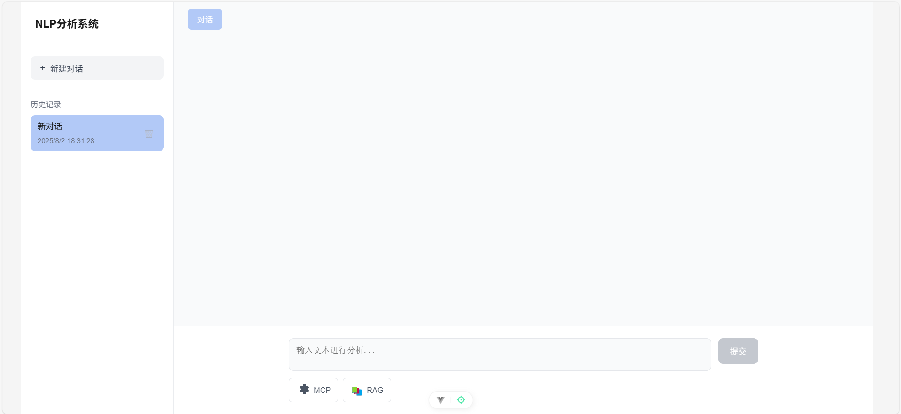

# LLM-Chat

一个基于大语言模型的聊天应用程序。

## 项目简介

LLM-Chat是一个使用大语言模型构建的智能聊天应用，允许用户与AI进行自然语言对话。该项目旨在提供一个简单易用的界面来与大型语言模型进行交互。


## 功能特点

- 🤖 基于大语言模型的智能对话
- 💬 实时聊天界面
- 🚀 快速响应和自然语言处理
- 🎨 简洁美观的用户界面

## 技术栈

- Python
- 大语言模型 (LLM)
- 自然语言处理 (NLP)
- MCP
- Graph_RAG
- RAG
- Agent

- JavaScript
- Vue

## 安装指南
1. 安装项目
```bash
# 克隆项目
git clone https://github.com/your-username/LLM-Chat.git

# 进入项目目录
cd LLM-Chat
```
2. 启动后端
```bash
# 进入后端
cd backend

# 修改环境变量
cp .env_example .env

# 运行后端
python main.py
```
3. 启动前端
```bash
# 进入前端
cd frontend

# 安装依赖
npm install

# 启动前端
npm run dev
```